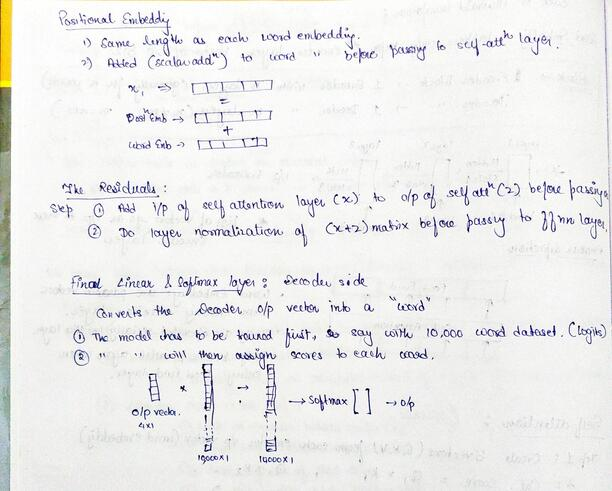

https://colab.research.google.com/drive/1M9wx3UzD5wlEAg_HGin-z89_BkcFf__n?usp=sharing:  The Modeling.py file is saved in this colab notebook. 
The code descriptions are made inline.

train.py: code explanation: https://colab.research.google.com/drive/1og0If5kmnemaMPi8RJDWZo0pve2DfbFr?usp=sharing

The reference repo is: https://github.com/jeonsworld/ViT-pytorch

 

 

 

 

 

 

